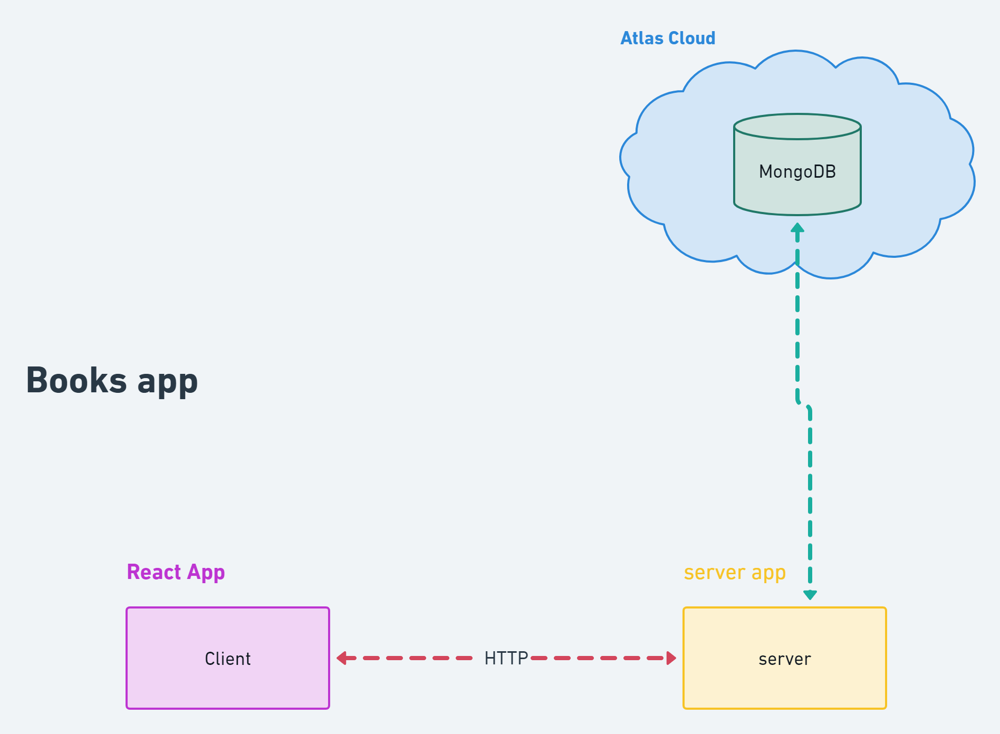

## initial plan

<!-- add image -->
           


this is the initial plan.

## basic db structure

### creating users collection with validation

```mongodb

db.createCollection("users", {
  validator: {
    $jsonSchema: {
      bsonType: "object",
      required: ["name", "email", "password"],
      properties: {
        name: {
          bsonType: "string",
          description: "must be a string and required",
        },
        email: {
          bsonType: "string",
          description: "must be a string and required",
        },
        password: {
          bsonType: "string",
          description: "must be a string and required",
        },
      },
    },
  },
});

```

